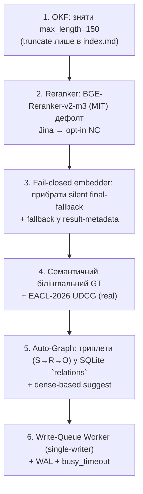

# P.O.W.E.R. Framework 3.2 — Детальний план реалізації (WTF-ремедіація)

> **Підстава:** `/root/geminicli/WTF_power-framework.md` (критичний аудит, липень 2026) + ADR 0001 (3.1 Trust-Release Baseline).
> **Базовий коміт коду:** `pyproject.toml` → `version = "3.1.0"`; ADR 0001 — Accepted (2026-07-21).
> **Системний контракт:** ≤ 12 ГБ RAM на AI-сервіси, резерв ≥ 4 ГБ для ОС/Docker; обов'язкова білінгвальна UA↔EN підтримка.
> **Протокол:** PAV (Plan → Act → Validate). Кожна фаза містить regression-тести + lint/typecheck.

---

## 0. Стан речей: аудит vs реальний код (попередня верифікація)

Щоб не дублювати вже виконану роботу, спочатку зафіксовано, що з кожного «WTF» вже зроблено в 3.1, а що лишається. Усі посилання — на реальні файли.

| WTF                          | Стан у коді 3.1.0 | Доказ у коді                                                                                                                                                                                                                                                                                       | Залишилось зробити                                                                                            |
| :--------------------------- | :---------------- | :------------------------------------------------------------------------------------------------------------------------------------------------------------------------------------------------------------------------------------------------------------------------------------------------- | :------------------------------------------------------------------------------------------------------------ |
| **#1 Фейковий UDCG**         | 🟡 Частково       | `core/metrics/udcg.py` — deprecated alias → `discounted_lexical_gain`. Але `scripts/check_search_quality.py:362` досі будує GT через `all(t in text for t in terms)` (term-AND лексичний) і досі використовує `normalized_discounted_lexical_gain` як PRIMARY gate.                                | Переписати GT на кураторський семантичний білінгвальний; замінити лексичний proxy на реальний EACL-2026 UDCG. |
| **#2 CC-BY-NC ліцензія**     | 🟡 Частково       | `core/reranker.py:9` — DEFAULT = `jinaai/jina-reranker-v2-base-multilingual`; рядки 45–50 gates за `POWER_ALLOW_NONCOMMERCIAL_MODELS` (fail-closed). Але MIT/Apache-альтернатива (BGE-Reranker-v2-m3) **не реалізована**; дефолт досі NC.                                                          | Впровадити `BGEM3Reranker` (MIT/Apache ONNX) як новий дефолт; Jina — лише opt-in з прапорцем.                 |
| **#3 Silent fallback на TF** | 🟡 Частково       | `searcher.py:159` `validate_dense_index` + `DenseIndexUnavailableError` (fail-closed); `embeddings.py:571-586` bge-m3 ініціалізація.raise loudly. Але `embeddings.py:626-629` залишає **мовчазний final fallback на fastembed**. CHANGELOG 2.3.0 фіксує FP-7 (semantic повертає `[]` без помилки). | Прибрати мовчазний final fallback; будь-який permitted fallback → у metadata результату + WARN у лог.         |
| **#4 OKF description ≤ 150** | 🔴 Не виправлено  | `core/models.py:97-101` — `max_length=MAX_DESCRIPTION_LENGTH` (150) → `ValidationError` при 152. `healer.py:185-188` обрізає до 150.                                                                                                                                                               | Прибрати `max_length` зі схеми; тримати ≤150 лише при збірці `index.md`/`_index.md`.                          |
| **#5 Напівручний Graph RAG** | 🔴 Не виправлено  | `relations.py` `suggest_related` (та `_v2`) — лише keyword/tag Jaccard (`_compute_overlap_score`). `synthesize.py`/`power_server.py synthesize_session` зберігає лише явні `related` у YAML. Таблиці `relations` у SQLite немає.                                                                   | Авто-екстракція триплетів `(S→R→O)` у SQLite `relations`; семантична пропозиція через dense embeddings.       |
| **#6 SQLite locks**          | 🟡 Частково       | `core/db.py:14-16` — вже WAL + `busy_timeout=30000`. Але немає Write Queue Worker — MCP-записи (`synthesize_session`, `ingest_note`) виконуються inline у `asyncio.to_thread`; конкурентні synthesize+search все одно б'ють lock.                                                                  | Винести операції запису/індексації у фонову чергу (single-writer worker).                                     |

> Висновок: **3.1 закрило поверхневий шар** (метрику перейменовано, bge-m3 fail-closed, SQLite WAL). **Глибинні проблеми (#4, #5, дефолт-NC-ранжувальник, лексичний GT, silent final-fallback, write-queue) — відкриті.**

---

## 1. Архітектура цільового стану (3.2.0)



Принципи:

- **Fail-closed за замовчуванням**, будь-permitted fallback → у structured result envelope + `logger.warning` (ADR 0001 decision 3).
- **Меморі-контракт ≤ 12 ГБ**: BGE-M3 (~1.6 ГБ RSS) + BGE-Reranker-v2-m3 (~0.8–1.2 ГБ) + batch=16 → пік ≤ 4.5 ГБ на AI-сервісах, +4 ГБ резерв.
- **Білінгвальність**: BGE-M3 (1024d, UA↔EN) + BGE-Reranker-v2-m3 (UA↔EN) — обидва мультимовні.

---

## 2. Покроковий план (фази)

### Фаза A — Зняття бюрократичного тертя OKF (WTF #4)

**Файли:** `src/power_framework/core/models.py`, `src/power_framework/core/indexer.py`, `src/power_framework/core/healer.py`, `tests/test_models.py`

**A1. Прибрати `max_length` зі схеми `OKFMetadata.description`.**

- `models.py:97-101`: видалити `max_length=MAX_DESCRIPTION_LENGTH`; залишити `min_length=1`. Зберегти `MAX_DESCRIPTION_LENGTH` як константу для індексу.
- `healer.py:185-188`: **не** обрізати `description` у нотатці (оновити test, що довгий опис зберігається).

**A2. Тримати ≤150 лише при збірці каталогу.**

- `indexer.py` (рядки ~44, ~214): де формуюється `index.md`/`_index.md` — додати helper `truncate_for_catalog(desc, MAX_DESCRIPTION_LENGTH)`, що обрізає з `…` і використовується **лише** у рядку каталогу. У самій нотатці опис не чіпати.

**A3. Тести (regression):**

- `tests/test_models.py`: додати кейс — `OKFMetadata(description="x"*500)` проходить без `ValidationError`.
- `tests/test_models.py`: додати кейс — `description` довжиною 1 проходить (min_length), порожній — падає.
- Тест на `indexer`, що каталог містить обрізаний опис, а файл — повний.

**Validate:** `pytest tests/test_models.py tests/test_healer.py tests/test_indexer.py -v`; `ruff check src tests`; `mypy src/power_framework`.

---

### Фаза B — Ліцензійно-чистий дефолт-ранжувальник (WTF #2)

**Файли:** `src/power_framework/core/reranker.py`, `src/power_framework/core/embeddings.py` (реєстр моделей), `pyproject.toml`, `release/models.lock.json`, `tests/test_reranker.py`

**B1. Реалізувати `BGEM3Reranker` (MIT/Apache).**

- Модель: `bge-reranker-v2-m3` (ONNX, ~0.8–1.2 ГБ RSS, UA↔EN). Завантаження через `huggingface_hub` + onnxruntime (аналогічно `BGEM3OnnxManager`), з SHA256-піном у `release/models.lock.json`.
- Додати `_verify_sha256` + `POWER_ALLOW_UNVERIFIED_MODELS` gate (повторити патерн із `embeddings.py:479-490`).
- Новий дефолт: `DEFAULT_RERANKER_MODEL = "bge-reranker-v2-m3"`; `get_reranker()` повертає його першим.

**B2. Jina → opt-in лише.**

- `reranker.py:9`: зробити Jina **не** дефолтом. Jina доступна лише якщо `POWER_RERANKER=jina` **і** `POWER_ALLOW_NONCOMMERCIAL_MODELS=1` (обидва прапорці). Інакше — `NonCommercialModelDisabledError`.
- `searcher.py:60-67` fallback у `_get_reranker`: при падінні дефолтного BGE-ранжувальника кидати помилку (fail-closed), а не мовчазно переходити на Jina.

**B3. Тести:**

- `tests/test_reranker.py`: `BGEM3Reranker` ранжує релевантний документ першим (UA+EN pair).
- Тест, що Jina без `POWER_ALLOW_NONCOMMERCIAL_MODELS` → `NonCommercialModelDisabledError`.
- Тест, що дефолт `get_reranker()` повертає `BGEM3Reranker`.

**Validate:** `pytest tests/test_reranker.py -v`; перевірити `release/models.lock.json` має SHA256 для bge-reranker-v2-m3; запустити `python -c "from power_framework.core.reranker import get_reranker; print(type(get_reranker()).__name__)"` → очікувано `BGEM3Reranker`.

---

### Фаза C — Fail-closed embedder (WTF #3, завершення)

**Файли:** `src/power_framework/core/embeddings.py`, `src/power_framework/core/searcher.py`, `tests/test_embeddings.py`, `tests/test_searcher.py`

**C1. Прибрати мовчазний final fallback.**

- `embeddings.py:621-629`: замість безумовного `FastEmbedManager` у гілці else — кидати `RuntimeError(f"unknown_provider:{provider}")`. Будь-який permitted fallback (qwen3→fastembed, рядки 592-601) вже має `logger.warning` — залишити, але додати маркер у structured статус.

**C2. Fallback у result metadata.**

- У `searcher.py`: коли `validate_dense_index` ловиться і дозволено fallback (напр. `POWER_ALLOW_DENSE_FALLBACK=1`), додати у `SearchResult`/envelope поле `retrieval_contract: "fts_fallback"` і `logger.warning`. За замовчуванням (без прапорця) — `DenseIndexUnavailableError` (вже є).

**C3. Тести:**

- `tests/test_embeddings.py`: невідомий `POWER_EMBED_PROVIDER` → `RuntimeError` (не FastEmbed).
- `tests/test_searcher.py`: semantic-режим без dense-індексу → `DenseIndexUnavailableError`; з `POWER_ALLOW_DENSE_FALLBACK=1` → FTS-результати + маркер у metadata.

**Validate:** `pytest tests/test_embeddings.py tests/test_searcher.py -v`; `ruff check`; `mypy`.

---

### Фаза D — Семантичний білінгвальний Ground Truth + реальний UDCG (WTF #1)

**Файли:** `scripts/check_search_quality.py`, `src/power_framework/core/metrics/`, `tests/test_search_quality.py`, `tests/test_udcg.py`, нові фікстури `tests/fixtures/semantic_gt.json`

**D1. Замінити term-AND GT на кураторський семантичний.**

- Новий файл `tests/fixtures/semantic_gt.json`: для кожного запиту — список **релевантних rel_path** (UA+EN пари), визначених людиною-куратором (НЕ лексичним `all(...)`). Це робить qrels незалежними від токенізації.
- `check_search_quality.py`: `build_qrels` — читати `semantic_gt.json` як основне джерело; term-AND залишити лише як опцію `--gt-mode=lexical` для діагностики (з deprecation warning). Прибрати `normalized_discounted_lexical_gain` з PRIMARY gate.

**D2. Реальний EACL-2026 UDCG.**

- Новий модуль `core/metrics/udcg_real.py`: реалізація Utility-Discounted Cumulative Gain (EACL 2026) з graded relevance (0–3) з GT-файлу + utility/discount weights. Замінити diagnostic proxy у harness.
- Прибрати `udcg.py` deprecated alias через один release-цикл: зберегти alias, але переправити на `udcg_real` (із `DeprecationWarning`).

**D3. Метрики, що чесно показують перевагу dense+reranker.**

- Запускати `--mode reranked` (BGE-M3 + BGE-Reranker) проти `--mode fts`: очікувано `ndcg@5(reranked) > ndcg@5(fts)` на семантичному GT (на лексичному GT ця перевага була прихована).

**D4. Тести:**

- `tests/test_search_quality.py`: qrels з `semantic_gt.json` стабільні; `udcg_real` монотонно залежить від позиції релевантного документа.
- `tests/test_udcg.py`: реальний UDCG vs ідеальне ранжування = 1.0; лексичний proxy = deprecated.

**Validate:** `python scripts/check_search_quality.py --vault /root/gemma/brain --mode reranked --gt-mode semantic`; очікувано `PASS` і `ndcg@5(reranked) > ndcg@5(fts)`. Зафіксувати evidence у `docs/tests/3.2.0-TEST.md` + SHA256 (за ADR 0001 Phase 0).

---

### Фаза E — Auto-Graph: семантична екстракція триплетів (WTF #5)

**Файли:** новий `src/power_framework/core/graph_extraction.py`, `src/power_framework/core/db.py`, `src/power_framework/core/synthesize.py`, `src/power_framework/mcp/power_server.py`, `src/power_framework/core/relations.py`, нові `tests/test_graph_extraction.py`

**E1. Схема SQLite `relations`.**

- `db.py`: додати таблицю
    ```sql
    CREATE TABLE IF NOT EXISTS relations (
        id INTEGER PRIMARY KEY AUTOINCREMENT,
        source_path TEXT NOT NULL,
        subject TEXT NOT NULL,
        relation TEXT NOT NULL,
        object TEXT NOT NULL,
        confidence REAL DEFAULT 1.0,
        created_at TEXT NOT NULL
    );
    CREATE INDEX IF NOT EXISTS idx_relations_source ON relations(source_path);
    ```

**E2. Екстрактор триплетів.**

- `graph_extraction.py`: `extract_triplets(content, note_path) -> list[Triplet]`. Два бекенди:
    1. **LLM-екстракція** (опціонально, за `OPENROUTER_API_KEY`): промпт витягує `(Суб'єкт, Відношення, Об'єкт)` з UA/EN тексту.
    2. **Локальна (дефолт, без API)**: regex + linguistic heuristics + dense-similarity над існуючими сутностями нотатника (використовує BGE-M3). Це тримає фреймворк API-optional (за ADR 0001 decision 6 — versioned, reproducible).
- Зберігати триплети у `relations` при кожному `synthesize_session` (фоново, через Write-Queue з Фази F).

**E3. Семантична пропозиція зв'язків.**

- `relations.py`: нова функція `suggest_related_semantic(vault_dir, target_path)` — використовує dense embeddings (косинус) між нотатками замість keyword-Jaccard. `suggest_related_tool` (MCP) — додати параметр `method: "keyword"|"semantic"`, дефолт `semantic` за наявності dense-індексу (інакше fail-closed/keyword з WARN).

**E4. Тести:**

- `tests/test_graph_extraction.py`: локальний екстрактор повертає очікувані триплети з фікстури; триплети записуються у `relations`.
- `tests/test_relations.py`: `suggest_related_semantic` ранжує семантично-близьку (але лексично різну) нотатку вище за просто-spam keyword.

**Validate:** `pytest tests/test_graph_extraction.py tests/test_relations.py -v`; перевірити, що `synthesize_session` залишає рядки у `relations` (інтеграційний тест).

---

### Фаза F — Write-Queue Worker (WTF #6, завершення)

**Файли:** новий `src/power_framework/core/write_queue.py`, `src/power_framework/mcp/power_server.py`, `tests/test_write_queue.py`

**F1. Single-writer background worker.**

- `write_queue.py`: черга `asyncio.Queue` + один фоновий `asyncio.create_task`, що серіалізує всі операції запису (atomic_write, index-regen, log-append, triplet-store). Це усуває `database is locked` (разом з WAL — один писар).
- MCP-тули `ingest_note`/`synthesize_session`/`generate_index` ставлять завдання у чергу через `await queue.put(job)`; пошукові (read-only) тули виконуються паралельно без черги.

**F2. Тести:**

- `tests/test_write_queue.py`: 10 паралельних `synthesize_session` → жодного `OperationalError`; порядок збережено; всі нотатки записані.
- Стрес-тест: одночасні `search_vault_tool` + `synthesize_session` → search не блокується надовго, write не падає.

**Validate:** `pytest tests/test_write_queue.py tests/test_mcp_server.py -v`; `power lint brain` exit 0 після пакетного запису.

---

### Фаза G — Меморі-контракт та release-evidence (≤ 12 ГБ)

**Файли:** `pyproject.toml`, `docs/release-3.2.md`, `docs/tests/3.2.0-TEST.md`, `release/models.lock.json`

**G1. Експлуатаційні параметри пам'яті.**

- `pyproject.toml`/env: `POWER_EMBED_BATCH_SIZE=16`, `POWER_EMBED_NUM_THREADS=2` (вже), BGE-M3 + BGE-Reranker-v2-m3.
- Додати в `release-3.2.md` таблицю вимірюваного RSS-піку (очікувано ≤ 4.5 ГБ на AI-сервісах), +4 ГБ резерв.

**G2. Reproducible release evidence (ADR 0001 Phase 0).**

- Зафіксувати: versioned runtime config + dep-lock hash, hardware profile, model revisions (SHA256 для bge-m3 + bge-reranker-v2-m3 у `models.lock.json`), збережені raw-outputs бенчмарку.

**Validate:** запустити `python scripts/check_search_quality.py` з зафіксованим config + lock; зафіксувати SHA256 у `docs/tests/3.2.0-TEST.md`.

---

## 3. Послідовність та залежності

```
A (OKF) ── незалежно ──┐
B (Reranker) ──> D (GT/UDCG потребує нового ранжувальника для бенчмарку) ──> G
C (Fail-closed) ──> E (Auto-Graph потребує dense embeddings, що тепер fail-closed)
F (Write-Queue) ──> E (triplet-store через чергу)
```

Рекомендований порядок: **A → C → B → F → E → D → G.** A, C, F — низькоризикові й розблоковують решту; D — фінальний бенчмарк, що підтверджує загальну якість.

---

## 4. Критерії приймання (Definition of Done для 3.2.0)

1. `OKFMetadata(description="x"*500)` не падає; `index.md` містить обрізаний опис.
2. `get_reranker()` дефолт повертає `BGEM3Reranker`; Jina лише з обома прапорцями.
3. Невідомий `POWER_EMBED_PROVIDER` → `RuntimeError`; semantic без індексу → `DenseIndexUnavailableError` (або fallback з маркером).
4. `check_search_quality.py --gt-mode semantic` показує `ndcg@5(reranked) > ndcg@5(fts)`.
5. `synthesize_session` записує триплети у `relations`; `suggest_related_semantic` працює.
6. 10 паралельних `synthesize_session` → 0 `OperationalError`.
7. Виміряний RSS-пік ≤ 4.5 ГБ на AI-сервісах; +4 ГБ резерв підтверджено.
8. `pytest` ≥ 70% coverage, `ruff check src tests` чисто, `mypy src/power_framework` — 0 помилок, `power lint brain` exit 0.
9. Evidence: `docs/tests/3.2.0-TEST.md` з SHA256 + `release/models.lock.json` з SHA256 bge-m3 та bge-reranker-v2-m3.

---

## 5. Ризики та мітигації

| Ризик                                        | Мітигація                                                                                           |
| :------------------------------------------- | :-------------------------------------------------------------------------------------------------- |
| BGE-Reranker-v2-m3 ONNX недоступний/segfault | SHA-пін + probe (як у `BGEM3OnnxManager`); fallback на keyword-rerank з WARN (не на Jina NC).       |
| LLM-екстракція триплетів недетермінована     | Дефолт — локальний regex+dense; LLM лише opt-in за `OPENROUTER_API_KEY`; evidence-бенчмарк без API. |
| Write-Queue уводить затримку                 | read-тули неблокуючі; write-тули ставлять `job_id` і повертають статус; lint-після-запису у фоні.   |
| Зміна GT ламає історичні бенчмарки           | Зберегти `--gt-mode=lexical` як deprecated; новий 3.2-бенчмарк у окремому `3.2.0-TEST.md`.          |

---

## 6. Оцінка зусиль (орієнтовно)

| Фаза            | Складність               | Тести |
| :-------------- | :----------------------- | :---- |
| A — OKF         | Мала                     | ~3    |
| B — Reranker    | Велика (ONNX-бекенд)     | ~4    |
| C — Fail-closed | Мала                     | ~3    |
| D — GT/UDCG     | Велика (кураторський GT) | ~4    |
| E — Auto-Graph  | Велика (екстрактор)      | ~5    |
| F — Write-Queue | Середня                  | ~3    |
| G — Evidence    | Середня                  | —     |

---

_План ґрунтовано на фактичному коді v3.1.0 за станом на 2026-07-23. Кожна фаза дотримується ADR 0001 (fail-closed, untrusted data, versioned evidence) та меморі-контракту ≤ 12 ГБ._
